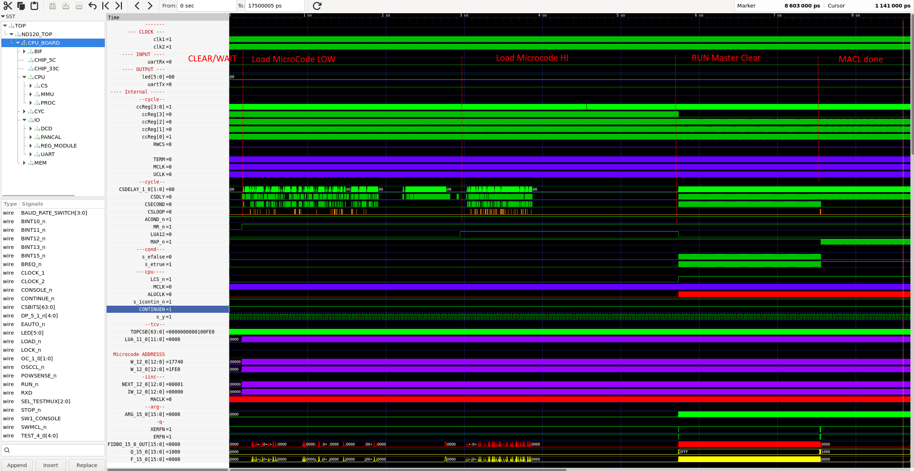

# Verilog code

The Verilog code has been split into subfolder matching the structure of the LogiSim and Design Documents

## Status

Verilator compiles and runs the full boot path: microcode load, "Master Clear",
then the MACL CPU self-test (currently **7 of 14 tests pass**), after which OPCOM
UART communication works (use the `runSim/` harness to interact with it). FPGA
synthesis passes but implementation/boot does not yet run correctly — closing the
latch-vs-flip-flop timing gap is the current focus.

| Folder                                         | Status Logisim           |  Status Verilog                                | Status Vivado                         | Comment    |
|------------------------------------------------|--------------------------|------------------------------------------------|---------------------------------------|------------|
| [DELILAH-CPU](CPU-BOARD-3202/readme.md)        | Logisim drawing complete | Verilog compiles - Missing a lot of testcases  | Syntehesis OK, implementation fails   | CGA        |
| [DECODE-GateArray](DECODE-GateArray/readme.md) | Logisim drawing complete | Verilog compiles - Missing a lot of testcases  | Syntehesis OK, implementation fails   | DGA        |
| [CPU-BOARD-3202](CPU-BOARD-3202/readme.md)     | Logisim drawing complete | Verilog compiles - Missing a lot of testcases  | Syntehesis OK, implementation fails   | Need to validate support chips TTL/MEMORY/++   |
| [PAL](../DesignDocuments/PAL-Code/readme.md)   | No logisim, PALASM source| Verilog compiles - Missing a lot of testcases  | Syntehesis OK, implementation fails   | Hand converted PALASM to Verilog for all PAL's |
| [Shared](Shared/readme.md)                     |                          | Verilog compiles - Missing a lot of testcases  | Syntehesis OK, implementation fails   | Shared code between the CPU, DGA and 3202D CPU board. Mix of converted logisim and manually created modules |


## Testbench conventions

Testbenches live in a `sim/` subdirectory next to the module source code:

```
<component>/
  circuit/
    module.v              ← source
  sim/
    Makefile              ← build & run targets
    module_tb.v           ← iverilog testbench
    test_module.cpp       ← Verilator testbench (if applicable)
    *.gtkw                ← GTKWave waveform configs
    README.md             ← test documentation
```

This keeps the test next to what it tests — no searching. Examples:

- `DELILAH-CPU/CGA_MIC/sim/MASEL_cycle_tb.v` tests `DELILAH-CPU/CGA_MIC/circuit/CGA_MIC_MASEL.v`
- `CPU-BOARD-3202/circuit/CPU_CS_ACAL_17/sim/` tests `CPU_CS_ACAL_17.v`

**Testbench types:**

| Tool | File pattern | Use case |
|------|-------------|----------|
| **iverilog** | `*_tb.v` | Fast unit tests, race-condition validation, timing checks |
| **Verilator** | `test_*.cpp` | Full-module simulation with C++ harness, waveform generation |

**Running testbenches:**

```bash
# From WSL, cd to the module's sim/ directory
cd /mnt/e/Dev/Repos/Ronny/nd-120/Verilog/DELILAH-CPU/CGA_MIC/sim

# iverilog testbenches
make test-masel          # run all MASEL tests
make test-masel-cycle    # run cycle/race testbench only

# Verilator full-module test
make all                 # compile, run, open GTKWave
```

> **Legacy:** `tests/vivado_warning_fixes/` contains older testbenches from
> the initial Vivado warning fix pass. New testbenches should go in the
> module's `sim/` directory following the convention above.

## Run Verilog code using Verilator

There are two top-level Verilator harnesses. They build the **same**
`ND120_TOP` module but serve opposite purposes — one is a hands-off waveform
logger, the other is a live interactive console. Pick by what you need to do:

| Folder     | Mode                     | Driven by                 | UART / OPCOM                                   | Stops when                | Use it to…                                                        |
|------------|--------------------------|---------------------------|-----------------------------------------------|---------------------------|-------------------------------------------------------------------|
| `sim/`     | **Automatic (batch)**    | `test_nd120.cpp`          | **Scripted** — canned commands auto-answer the CPU prompts | after a fixed tick budget | Capture FST waveforms for GTKWave and run latch-vs-FF regression  |
| `runSim/`  | **Interactive (manual)** | `Run120.cpp`              | **Live** — your keyboard is wired to the CPU serial line   | you press **Ctrl+C**      | Talk to the running CPU: drive OPCOM, type commands, watch output |

### `sim/` — automatic waveform logger (no keyboard input)

Boots a BPUN tape into simulated RAM, steps the clock for a fixed number of
ticks, and writes `waveform.fst`. The serial "conversation" is **pre-scripted**:
a bit-banged UART model watches the CPU's output and replies with hardcoded
commands — you *see* OPCOM output echoed to the terminal but **cannot type to
it** (stdin reading is intentionally disabled). This is the harness for
signal-level debugging and for proving a refactor didn't change behaviour.

```bash
cd /mnt/e/Dev/Repos/Ronny/nd-120/Verilog/sim
make clean
make all            # compile + run + open GTKWave (waveform.fst + top_3202d.gtkw)
make test_nd120     # compile only
make run            # run only (produces waveform.fst)
make gtk            # open GTKWave on the last run

# Latch-vs-FF regression: build both modes, run each, diff the traces
make compare        # -> trace_latch.csv vs trace_ff.csv -> trace_diff.txt
                    #    prints "IDENTICAL" or "DIVERGENCE FOUND"
```

### `runSim/` — interactive console (manual testing)

The one to use when you want to **operate the CPU by hand**. It puts your
terminal into raw, non-blocking mode, reads live keystrokes, and serializes
them onto the CPU's UART RX pin; CPU UART output is printed straight back to
the screen. It runs the microcode load + self-test and then drops you into the
program's interactive mode (OPCOM operator communication) over that serial
link. The loop runs **indefinitely until you press Ctrl+C**. Defaults to
loading `DEBUG.BPUN`; pass a different tape as the first argument.

```bash
cd /mnt/e/Dev/Repos/Ronny/nd-120/Verilog/runSim
make clean
make compile
make run                                # loads DEBUG.BPUN, gives you the console
./obj_dir/VND120_TOP INSTRUCTION-B.BPUN # run a different program tape
```

> Both harnesses honour `USE_LATCHES` (default `1` = original transparent-latch
> behaviour; `0` adds `-DFPGA_FF_MODE` for edge-triggered FPGA-style flip-flops)
> and always compile with `-DVERILATOR_SIM` (enables the bus ports, fast UART,
> and large simulation RAM — see RAM configuration below).

### RAM Configuration for Verilator vs FPGA

The design uses different RAM sizes for Verilator simulation vs FPGA synthesis:

- **Verilator Simulation**: 6MB RAM (6×1MB = `ramSize=2`)
  - Full memory for running complete programs
  - Enabled by `-DVERILATOR_SIM` flag in Makefiles (already configured in `sim/Makefile` and `runSim/Makefile`)

- **FPGA Synthesis**: 24KB RAM (6×4KB = `ramSize=3`)
  - Reduced size to fit in FPGA BRAM (xc7a35t has only 100 RAMB18 blocks)
  - 6MB would require 3496 RAMB18 blocks (35× device capacity)
  - Sufficient for testing CPU logic and small programs

The configuration is automatic based on compile-time defines in `MEM_RAM_49.v`. No manual changes needed.

## FPGA Targets

FPGA build/flow files live under [`fpga/`](fpga/README.md), one folder per board.
The HDL source is shared; only board-specific build scripts, constraints, and
tool projects are per-target. See [`fpga/README.md`](fpga/README.md) for the
overview.

| Target | FPGA | Toolchain | Status |
|--------|------|-----------|--------|
| [**Tang Nano 20K**](fpga/tang-nano-20k/README.md) *(primary)* | Gowin `GW2AR-18` (20,736 LUT4, 828 Kbit BSRAM, 8 MB SDRAM, 27 MHz) | Gowin EDA / OSS yosys+nextpnr (Linux-native) | Bring-up in progress |
| [**Basys3**](fpga/basys3/README.md) | Xilinx Artix-7 `xc7a35tcpg236-1` (33,280 LUT6, ~1,800 Kbit BRAM, 100 MHz) | Vivado (Windows host) | Synthesis OK; **fails timing** (WNS approx -100 ns), does not boot |

**Current focus is the Tang Nano 20K** - faster Gowin synthesis than Vivado, a
Linux-native OSS toolchain, and 8 MB SDRAM that lets the FPGA run the full memory
config like the simulator. Basys3 is the second target once Tang works.

Key shared facts:

- **The boot blocker is timing, not logic.** The FF-mode Verilator sim boots
  correctly; both FPGAs fail because ~35 modules clock flip-flops on *derived*
  signals instead of `sysclk`. The fix (single `sysclk` + clock-enables) is
  board-independent. Details: [`docs/fpga-debug-methodology.md`](docs/fpga-debug-methodology.md).
- **Microcode preload:** `SKIP_WCS_LOAD` bitstream-preloads the WCS and skips the
  runtime load phase (verified in Verilator; required to fit the Tang's BSRAM).
  Details: [`docs/skip-wcs-load.md`](docs/skip-wcs-load.md).
- Per-target compile-time defines: [`docs/build-defines.md`](docs/build-defines.md).
- Expected boot sequence for validation: [`docs/boot-golden-spec.md`](docs/boot-golden-spec.md).
- Overall plan: [`FPGA-BRINGUP-PLAN.md`](FPGA-BRINGUP-PLAN.md).

## Verilog code status

| Folder           | # of Verilog Files       | Lines of Verilog code  |
|------------------|--------------------------|------------------------|
| DELILAH-CPU      | 147                      | 22,976                 |
| DECODE-GateArray |  28                      | 4,316                  |
| CPU-BOARD-3202   |  84                      | 48,219                 |
| TOTAL            | 259                      | 75,511                 |

* [Other - including PAL's](Other/Readme.md)

Note: When all modules are merged, number of files and number of lines will be reduced as there is multiple copies of "base components" from Logisim

## Tracking total code over time


| Date       | Files | Lines of code | Lines of comments | Blank lines | Total lines |
|------------|-------|---------------|-------------------|-------------|-------------|
| 21.05.2024 | 262	 |    69,237	 |  10,453	         | 6,721	   |  86,411     |
| 11.11.2024 | 263   |    69,686	 |  10,210	         | 6,807       |  86,703     |
| 28.11.2024 | 264   |    69,731     |   9,853           | 6,694       |  86,278     |

# CPU Boot process

* Some delay to reset all components
* Loads Microcode first 32KB (low)
* Loads Microcode next 32KB (high)
* Starts at microcode address 0 (Master Clear/Power Clear)
* Jumps to MACL
* Clears/Initializes internal registers and sets up UART
* Runs self-test program for CPU, Test 1-8

* Depending on the input from the PANEL keylock it will either try to automatic load code from storage depending on ALD settings 
* - or go to OPCOM mode where one can communicate with the CPU via UART

## Test program verification

